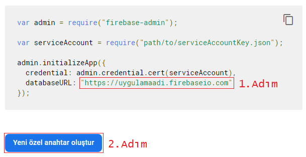
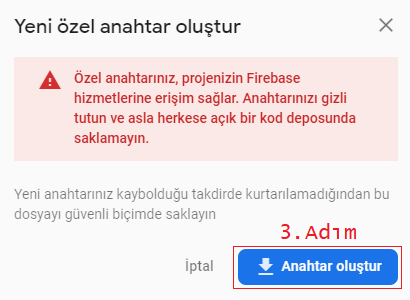

#Firestore JSON Yükleyicisi
###### JSON dosyalarını Cloud Firestore'a yükleme aracı.

## Özellikler

- Birden fazla JSON dosyasını Firebase'e yükleme
- Gömülü dizelere sahip JSON dosyalarını yükleyebilme
- Koleksiyon anahtarı oluşturma
- Belge anahtarı oluşturma

## KURULUM

> Node paketlerini kurarak projeyi ayağa kaldırın. 
```sh
 npm install
```
**1.Adım**: **yukleyici.js** dosyasındaki databaseURL kısmına Firestore "**Settings/Hizmet Hesapları**" panelinde yer Admin SDK yapılandırma snippet'ındaki **databaseURL**'i yazın.




**2.Adım:** Aynı sayfadaki "**Yeni özel anahtar oluştur**" butonuna tıklayın.



**3.Adım:** gelen bildirimdeki "**Anahtar oluştur**" butonuna tıkalyın ve .json uzantılı dosyayı proje dizine kopyalayın. Proje dizinde eklediğiniz dosyayı "**hizmet-anahtari.json**" olarak adlandırın.

**4.Adım:** Frestore'a göndermek istediğiniz herhangi bir JSON dosyasını dosyalar dizininde bulunan "**ornek.json**" dosyası referans alarak düzenleyin. Daha sonra JSON dosyalarınızı "**dosyalar**" klasörüne kopyalayın ve "ornek.json" dosyasını silin.

* _**Artık uçuşa geçebilirsiniz:**_

```sh
 node yukleyici.js
```

>**ÖNEMLİ:** Derleyici çalıştırıldığında JSON dokümanı ile aynı ada sahip Firestore'da bir "_Koleksiyon Kimliği_" oluşturulur.


>**ÖNEMLİ:** JSON dokümanındaki her bir dizi bir belgeID ile tanımlanmalıdır. **belgeID** Firestore'da "_Belge Kimliği_" olarak yazdırılacaktır. Bu işlem yapılmazsa hata alınır. 

License
----

MIT
